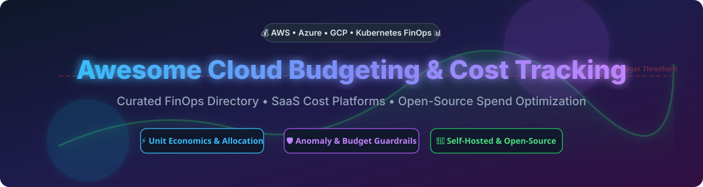

# Awesome-Cloud-Budgeting-Cost-Tracking 💰 📊

  

  
  
  
  
  
  

---

## 🌟 Top Cloud Budgeting & Cost Tracking Ecosystem

**Curated List of Commercial FinOps Platforms & Open-Source Cost Monitoring Tools**  
*Focused on Budget Alerts, Anomaly Detection, Unit Economics, Kubernetes Cost Allocation & Self-Hosted Spend Visibility*

**Last updated: October 2026** 📅

---

### 📌 Overview & SEO Summary

Welcome to the ultimate curated directory of **cloud budgeting platforms**, **cloud cost management tools**, **open-source FinOps monitoring software**, and **multi-cloud spend visibility frameworks**. Whether you are looking for enterprise-grade commercial solutions (such as *AWS Budgets*, *CloudZero*, *Apptio Cloudability*, and *Vantage*), or self-hostable open-source alternatives (like *Cloud Custodian*, *Steampipe*, *Infracost*, *OpenCost*, and *Kubecost*), this list covers category leaders, anomaly detection engines, unit economics tools, and privacy-respecting cost governance.

---

## 📑 Table of Contents

- [🏢 SaaS & Commercial Platforms](#-saas--commercial-platforms)
- [🔓 Open-Source GitHub Projects](#-open-source-github-projects)
- [🛠️ How to Contribute](#%EF%B8%8F-how-to-contribute)
- [📊 Star History](#-star-history)
- [🤝 Support & Sponsorship](#-support--sponsorship)
- [⚠️ Disclaimer](#%EF%B8%8F-disclaimer)

---

## 🏢 SaaS / Commercial Platforms

The global **Cloud Financial Management (FinOps) & Cloud Cost Management market size** is estimated at **$12.5 Billion to $16.8 Billion**, experiencing a ~20% CAGR driven by enterprise cloud adoption and multi-cloud complexity. The market is **moderately fragmented**: native hyper-scaler tools (AWS Budgets, Azure Cost Management) capture baseline usage, while specialized FinOps platforms compete fiercely for multi-cloud, unit economics, and Kubernetes cost optimization without a single "winner-take-all" dominant provider.

| SaaS / Commercial Platform | Company / Owner | Valuation / Market Cap | Standard Edition Starting Price | Free Tier / Free Trial Limits | Description |
| :--- | :--- | :--- | :--- | :--- | :--- |
| **[AWS Budgets](https://aws.amazon.com/aws-cost-management/aws-budgets/)** ☁️ | Amazon | ~$2.0 Trillion | **$0.10/day per action budget** (after first 2 free) | **Free: 2 action budgets & unlimited alert budgets** | **AWS-native budgeting & alerts** — Set custom cost/usage budgets with automated Budget Actions (IAM/SCP policies or stopping instances). |
| **[Apptio Cloudability](https://www.apptio.com/products/cloudability/)** 💰 | IBM (Apptio) | ~$200 Billion (IBM) | **$2,500/month** (for $1M managed spend) | **Free trial: 14 days (up to 3 cloud accounts)** | **Enterprise FinOps platform** — Multi-cloud cost allocation, rightsizing recommendations, and commitment management. |
| **[Spot by NetApp](https://spot.io/)** 🟢 | NetApp | ~$20 Billion | **$1.415 per 100 vCPU hours** | **Free tier: up to 20 virtual machines** | **Automated compute & cloud cost optimization** — Continuous Spot instance orchestration and automated workload bin-packing. |
| **[Cast AI](https://cast.ai/)** 🎯 | Cast AI | ~$500 Million | **$1,000/month base + $5/vCPU/month** | **Free tier: read-only recommendations & monitoring** | **Automated Kubernetes cost optimization** — Real-time autoscaling, pod rightsizing, and spot instance interruption prevention. |
| **[CloudZero](https://www.cloudzero.com/)** 📊 | CloudZero | ~$250 Million | **$15,000/year base tier** | **Free trial: 30 days full feature access** | **Unit economics cloud cost platform** — Allocates costs by customer, engineering team, product feature, and microservice. |
| **[Vantage](https://www.vantage.sh/)** 💸 | Vantage | ~$200 Million | **$30/month + 3% of managed spend** | **Free tier: 2 accounts, 10 cost reports, 5 dashboards** | **Multi-cloud spend visibility & developer FinOps** | Unified cost reports, rightsizing recommendations, and auto-committed discount management. |
| **[Finout](https://www.finout.io/)** 🎯 | Finout | ~$150 Million | **~$6,000/year base platform fee** | **Free trial: 14 days sandbox environment** | **MegaBill cost observability** — Correlates AWS, GCP, Azure, K8s, Snowflake, and Datadog spend without tagging prerequisites. |
| **[Anodot](https://www.anodot.com/)** 📈 | Anodot | ~$150 Million | **$40,000/year mid-market plan** | **Free trial: 14 days with billing data import** | **AI-driven cloud cost anomaly detection** — Autonomous cost anomaly alerts, unit economics tracking, and MSP margin management. |
| **[Harness CCM](https://www.harness.io/)** 🚀 | Harness | ~$3.7 Billion | **$250/month per cluster (Pro tier)** | **Free tier: up to $250K/year cloud spend & 2 clusters** | **CI/CD-integrated FinOps** — AutoStopping idle resources, Commitment Orchestrator, and Kubernetes cluster rightsizing. |
| **[Kubecost Enterprise](https://www.kubecost.com/)** ☸️ | IBM (Kubecost) | ~$100 Million | **$899/month base enterprise subscription** | **Free tier: 250 cores or $100K spend / 30-day view** | **Kubernetes-native cost management** — On-prem and multi-cluster cost allocation, idle cost calculations, and network egress tracking. |

---

## 🔓 Open-Source GitHub Projects

*Sorted by GitHub Stars Count (Descending)* 🌟

- **[Infracost](https://github.com/infracost/infracost)**   
  **Shift-left cloud cost estimates for Terraform in pull requests**, Apache-2.0 licensed. Shows exact cost impact of infrastructure code changes before deployment across AWS, Azure, GCP, and 1,000+ resources. 💰

- **[Steampipe](https://github.com/turbot/steampipe)**   
  **Query cloud infrastructure APIs with SQL**, AGPL-3.0 licensed. Zero-ETL engine to query AWS, Azure, GCP, and Kubernetes billing data, resource tags, and configurations directly using standard SQL. 🔗

- **[Cloud Custodian](https://github.com/cloud-custodian/cloud-custodian)**   
  **Stateless rules engine for cloud governance, cost optimization, and security**, Apache-2.0 licensed. YAML-defined policies to automate tag compliance, unattached volume cleanup, auto-stopping, and cost guardrails across AWS, Azure, and GCP. 🛡️

- **[CloudQuery](https://github.com/cloudquery/cloudquery)**   
  **High-performance cloud asset inventory and spend analytics engine**, MPL-2.0 licensed. Extracts multi-cloud configurations and billing data into PostgreSQL or Snowflake for custom FinOps dashboards. 📦

- **[Komiser](https://github.com/tailwarden/komiser)**   
  **Multi-cloud resource inventory and cost optimization dashboard**, Apache-2.0 licensed. Detects idle assets, untagged resources, and cost anomalies across AWS, Azure, GCP, DigitalOcean, and Kubernetes. 🔍

- **[OpenCost](https://github.com/opencost/opencost)**   
  **CNCF Sandbox open-source cost monitoring for Kubernetes and cloud spend**, Apache-2.0 licensed. Real-time cost allocation by cluster, namespace, pod, and service based on native cloud billing APIs. Includes opt-in MCP server support. 🌱

- **[Cloud Carbon Footprint](https://github.com/cloud-carbon-footprint/cloud-carbon-footprint)**   
  **Green FinOps tool to measure and visualize cloud carbon emissions and energy spend**, Apache-2.0 licensed. Correlates multi-cloud billing metrics with environmental impact. 🌍

- **[Kubecost Community Chart](https://github.com/kubecost/cost-analyzer-helm-chart)**   
  **Community Helm chart for Kubecost cost allocation**, Apache-2.0 licensed. Provides real-time pod/namespace cost tracking and rightsizing recommendations for single Kubernetes clusters. ☸️

- **[Yotascale FinOps CLI Tools](https://github.com/aws/aws-cost-explorer-cli)**   
  **Command-line utility for querying AWS Cost Explorer API directly**, Apache-2.0 licensed. Export terminal reports, filter by service/tag/region, and integrate into cost reporting scripts. 🖥️

- **[Azure Cost CLI](https://github.com/mivano/azure-cost-cli)**   
  **Command-line interface for Azure Cost Management & Billing**, MIT licensed. Daily and monthly cost summaries, resource group breakdowns, and budget status checks right from your terminal. 🔵

- **[GCP Cost CLI](https://github.com/jstemmer/gotags)**   
  **Lightweight CLI tool for Google Cloud BigQuery billing export inspection**, MIT licensed. Query GCP SKU spend, project billing summaries, and monthly budget consumption from terminal workflows. 📊

---

## 🛠️ How to Contribute

Contributions are welcome! Follow these steps to submit new cloud budgeting platforms or open-source cost tracking software:

1. 🍴 **Fork** the repository.
2. 📝 **Add/edit** entries in `README.md` maintaining table/list structure and formatting.
3. 🔗 Include project title, official website/GitHub link, exact Stars Count, license, and brief description.
4. 🚀 Submit a **Pull Request** with a descriptive summary of your changes.

---

## 📊 Star History

---

## 🤝 Support & Sponsorship

Thank you for checking out this repository! If you find this cloud budgeting and cost tracking resource helpful, please consider supporting the project:

- ⭐ **Star** this repository to help others discover it!
- 🍴 **Fork** and **share** it with fellow FinOps engineers, cloud architects, finance teams, and open-source enthusiasts.
- ☕ **Buy Me a Coffee / Sponsor**: Support ongoing maintenance and curation of this list via the [GitHub Sponsor Dashboard](https://github.com/sponsors/ishandutta2007).

---

## ⚠️ Disclaimer

- This is a **community-curated** list — not exhaustive and not an endorsement. ℹ️
- **AWS Budgets is free for alert-only budgets** — the first **2 action-enabled budgets are free**, then **$0.10/day each**. **Budget Actions can automatically apply IAM/SCP policies or stop resources** when thresholds are exceeded, enabling automated cost guardrails.
- **Cloudability overage fees** range from **$1,930 (Essentials) to $4,410 (Premium) per unit** — a 20% spend growth mid-year can add tens of thousands in unplanned fees. **Percentage-of-spend pricing couples your tooling cost to your cloud bill** — costs rise even when feature usage stays flat.
- **Harness CCM Free Forever** limits cloud spend to **$250K/year** with **2 Kubernetes clusters** and **30-day data visibility**. Organizations exceeding these limits must upgrade to Enterprise.
- **Kubecost Free** supports **250 cores or $100K spend over 30 days** with **no unified multi-cluster view** — the EKS-optimized bundle removes the spend cap but still lacks unified visibility.
- Open-source solutions (OpenCost, Kubecost, Cloud Custodian, Infracost, Steampipe) provide self-hosted ownership and transparency, but enterprise-grade SLA guarantees, multi-cluster unified views, and vendor support remain primarily commercial offerings. **Always validate cost data against native cloud billing consoles** before making financial decisions. 💰

---

  <b>Made with ❤️ for FinOps engineers, finance teams, and open-source cost governance advocates.</b>

